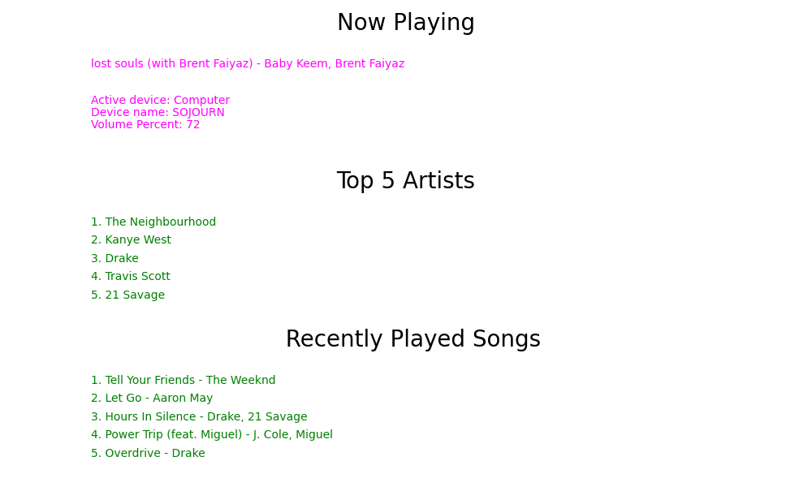

# SpotiStats

SpotiStats is a Python script that leverages the Spotify API to provide users with insights into their music listening habits. With SpotiStats, you can easily retrieve information about the current now playing song, your top 5 artists, and your 5 recently played songs.

## Table of Contents

- [Installation](#installation)
- [Usage](#usage)
- [Configuration](#configuration)
- [License](#license)

## Installation

1. Clone the repository to your local machine:

   ```bash
   git clone https://github.com/smazurs/spotiStats.git
   ```

2. Change to the project directory:

   ```bash
   cd spotiStats
   ```

3. Install the required dependencies:

   ```python
   pip install spotipy
   pip install colorama
   pip install matplotlib
   ```

## Usage

1. Ensure you have a Spotify account and create a Spotify Developer App to obtain your client ID and client secret.

2. Set up your Spotify API credentials by following the [Configuration](#configuration) section.

3. Run the SpotiStats script:

   ```python
   python spotiStats.py
   ```

4. Follow the on-screen prompts to authorize the application to access your Spotify account.

5. SpotiStats will then display information about your now playing song, top 5 artists, and 5 recently played songs.

## Configuration

Before using SpotiStats, you need to configure your Spotify API credentials. Follow these steps:

1. Go to the [Spotify Developer Dashboard](https://developer.spotify.com/dashboard/) and log in with your Spotify account.

2. Create a new App to obtain your Client ID and Client Secret.

3. Open `main.py` and replace `YOUR_CLIENT_ID` and `YOUR_CLIENT_SECRET` with your Spotify App's credentials.

   ```python
   CLIENT_ID = 'your_client_id'
   CLIENT_SECRET = 'your_client_secret'
   ```
4. Save the changes.

Now you're ready to use SpotiStats with your personalized Spotify API credentials.

## Output Example

  

## License

This project is licensed under "The Unlicense" License - see the [LICENSE](LICENSE) file for details.
